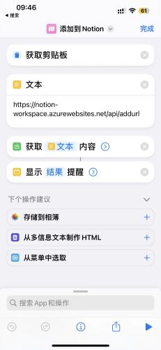
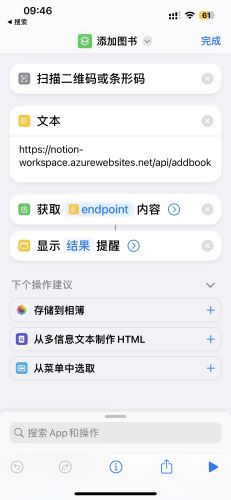
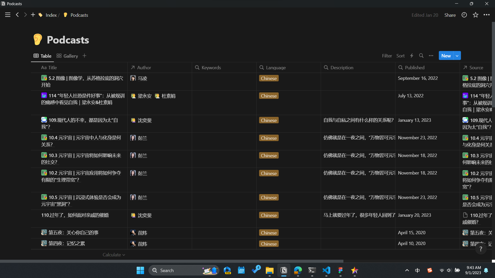
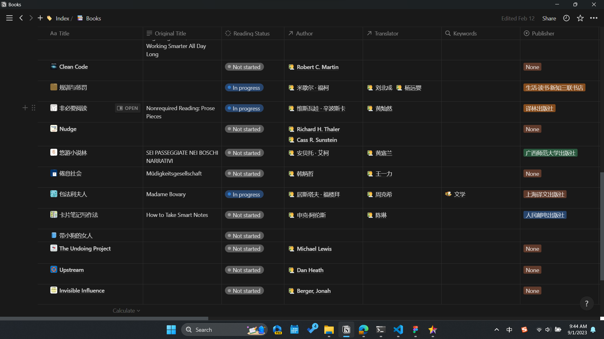
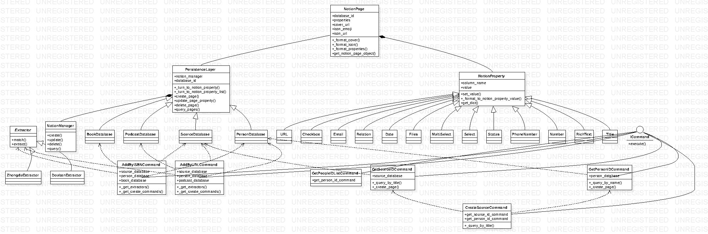

# Notion 知识库 API

平日里我喜欢阅读书本、听播客、看视频，并将笔记记录在 Notion 中。手动输入文献信息很麻烦，我希望可以通过 API 将文献信息导入 Notion 中。这个 API 可以从豆瓣、三联中读、小宇宙等网站爬取文献信息，并将信息导入 Notion 中。配合iOS的快捷指令，还可以直接扫描图书条形码添加文献信息~

## 项目信息

本项目使用 Azure Functions Python V2 Model 进行无服务函数开发。

### iOS快捷指令

### Notion效果

## 类图

